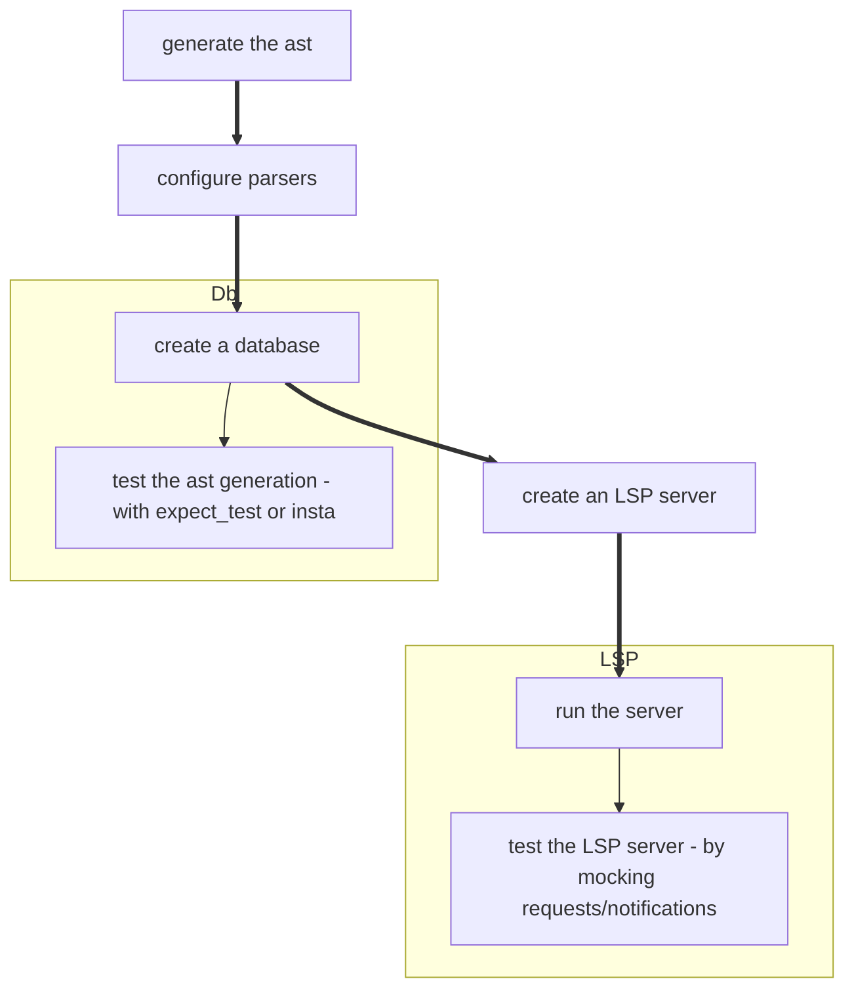

# Architecture

## Introduction

`auto_lsp` is a generic library for creating Abstract Syntax Trees (AST) and Language Server Protocol (LSP) servers.

It leverages crates such as [lsp_types](https://docs.rs/lsp-types/0.97/lsp_types/), [lsp_server](https://docs.rs/lsp-server/latest/lsp_server/), [salsa](https://docs.rs/salsa/latest/salsa/), and [texter](https://docs.rs/texter/latest/texter/), and generates the AST of a Tree-sitter language to simplify building LSP servers.

`auto_lsp` provides useful abstractions while remaining flexible. You can override the default database as well as all LSP request and notification handlers.

The library is inspired by language tools such as [rust-analyzer](https://github.com/rust-lang/rust-analyzer) and [ruff](https://github.com/astral-sh/ruff), but with a Tree-sitter touch.

It was originally created as a way to quickly ship LSP servers without reinventing the wheel for each new language.

## Crates

### [auto_lsp](https://github.com/adclz/auto-lsp/tree/main/src)

This the main crate that reexports **auto_lsp_core**, **auto_lsp_codegen**, **auto_lsp_default** and **auto_lsp_server**.

### [auto_lsp_core](https://github.com/adclz/auto-lsp/tree/main/crates/core)

**auto_lsp_core** is the most important crate, it exports:

- `ast` Defines the AstNode trait and templates used by the codegen crate to build the AST.
- `document` The Document struct that stores the text and Tree-sitter tree of a file.
- `parsers` Contains the Parsers struct that stores a Tree-sitter parser and an AST parser function, configured via the `configure_parsers!` macro. This is used by the db to know how to parse a file.

Additional features:

- `document_symbols_builder` A [DocumentSymbols](https://microsoft.github.io/language-server-protocol/specifications/lsp/3.17/specification/#textDocument_documentSymbol) builder
- `semantic_tokens_builder` A [SemanticTokens](https://microsoft.github.io/language-server-protocol/specifications/lsp/3.17/specification/#textDocument_semanticTokens) builder
- `regex` A method that applies regex captures over the results of a Tree-sitter query and returns the captures.
- `dispatch!` and `dispatch_once!` Macros that make it more convenient to call a method on one or all nodes that match a given concrete type without having to write redundant downcasting code.

### [auto_lsp_codegen](https://github.com/adclz/auto-lsp/tree/main/crates/codegen)

**auto_lsp_codegen** contains the code generation logic.
Unlike **auto_lsp_core**, codegen is not reexported by the main crate.

It just exposes a `generate` function that takes a [`node-types.json`](https://tree-sitter.github.io/tree-sitter/using-parsers/6-static-node-types.html), a [`LanguageFn`](https://docs.rs/tree-sitter-language/0.1.5/tree_sitter_language/struct.LanguageFn.html) and returns a **proc_macro2::TokenStream**. 

### [auto_lsp_default](https://github.com/adclz/auto-lsp/tree/main/crates/default)

**auto_lsp_default** contains the default database and server capabilities.
It is reexported by the main crate when the `default` feature is enabled.

### [auto_lsp_server](https://github.com/adclz/auto-lsp/tree/main/crates/server)

**auto_lsp_server** contains the logic for starting an LSP server.
It is reexported by the main crate when the `lsp_server` feature is enabled.

## Examples

- [ast-python](https://github.com/adclz/auto-lsp/tree/main/examples/ast-python)

This example is the most complete one, it contains the generated AST from `tree_sitter_python`, LSP requests, a database and a custom parser.

- [ast-html](https://github.com/adclz/auto-lsp/tree/main/examples/ast-html)

This example is a bit more minimal, it only contains the generated AST from `tree_sitter_html` and a database.

- [vscode-wasi](https://github.com/adclz/auto-lsp/tree/main/examples/vscode-wasi)

Runs the `ast-python` example in a vscode extension using the WASI SDK.

- [vscode-native](https://github.com/adclz/auto-lsp/tree/main/examples/vscode-native)

Runs the `ast-python` example in a vscode extension using either Windows or Linux.

- [native](https://github.com/adclz/auto-lsp/tree/main/examples/native)

Runs the `ast-python` example in a native binary with a client mock.

## Testing

Most tests are located in the [examples](https://github.com/adclz/auto-lsp/tree/main/examples) folder.

Alongside testing the behavior of the AST, database, and LSP server,
we also test whether the generated ASTs are correct in the `corpus` folder using [insta](https://insta.rs/).

Workflows:

- [codegen](https://github.com/adclz/auto-lsp/blob/main/.github/workflows/ast-gen-wasi-p1-threads.yml): 
Tests the `auto_lsp_codegen` crate.

- [test-ast-native](https://github.com/adclz/auto-lsp/blob/main/.github/workflows/ast-gen-native.yml): 
Run main crate tests, ast-python and ast-html tests on Windows and Linux targets.

- [test-ast-wasi-p1-threads](https://github.com/adclz/auto-lsp/blob/main/.github/workflows/ast-gen-wasi-p1-threads.yml): 
Same as above but for wasi-p1-threads target.

- [lsp-server-native](https://github.com/adclz/auto-lsp/blob/main/.github/workflows/lsp-server-native.yml): 
Runs a real LSP server with a client mock.

## Workflow

This is the current workflow used in internal projects when creating a new language support.

## License

auto_lsp is licensed under the [GPL-3.0 license](https://www.gnu.org/licenses/gpl-3.0.en.html#license-text).
