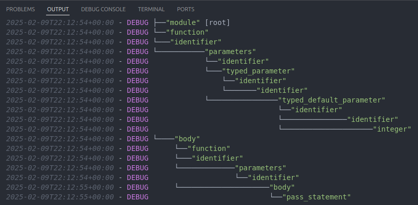

# Logging

```admonish
Logging is only available in the `log` feature.
```

To ensure compatibility with **WebAssembly**, all logs use stderr output.

```admonish warning
Logs will severely impact performance, and should be used for debugging purposes.
```

Logs are displayed with a timestamp and log levels.

Logs show in real time:
 - All nodes received from the Core query, including unknown nodes.
 - Incremental updates locations.
 - Number of unsolved checks.


