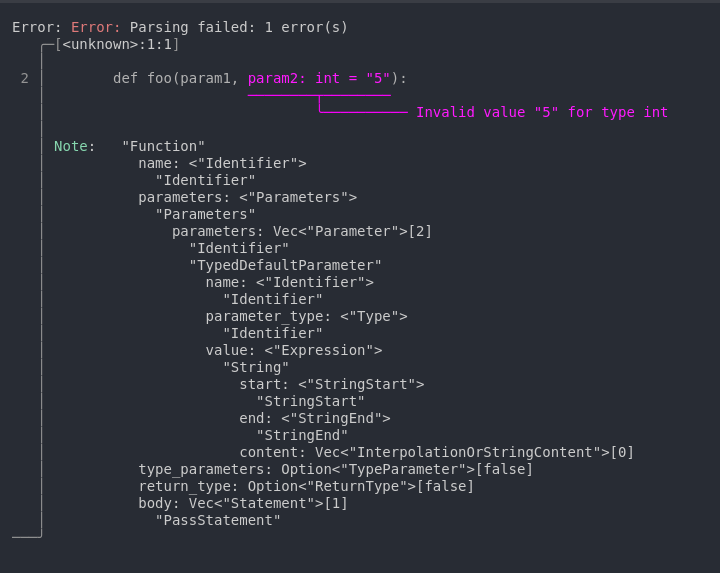

# Reports

Each symbol defined in the AST can be tested independently using the `test_parse` method.

```rust, ignore
use auto_lsp::core::ast::*;
use auto_lsp::{seq, choice};

#[seq(query = "document")]
struct Document {
    functions: Vec<Function>,
}

#[seq(query = "function")]
struct Function {
   name: Identifier,
}

#[seq(query = "identifier")]
struct Identifier {}

// Test Function independently from Document
#[test]
fn function() -> TestParseResult {
   Function::test_parse(
    r#"function foo()"#)
}
```

If `test_parse` fails, an [Ariadne](https://docs.rs/ariadne/latest/ariadne/) report is generated.
This report contains both the error locations and the AST tree, making it easier to diagnose parsing issues

## Example with a type error in Python

```rust, ignore
#[test]
fn function() -> TestParseResult {
   Function::test_parse(
       r#"
       def foo(param1, param2: int = "5"):
           pass
       "#,
       &PYTHON_PARSERS.get("python").unwrap(),
   )
}
```

This code will return the following error when running tests:


