# Tree Life Cycle

## A note about incremental updates

While tree-sitter provides incremental updates for its own tree, updating an AST derived from this tree is a more complex task.

Currently, tree-sitter offers several ways to know how a tree is affected by changes:

- [`has_changes`](https://docs.rs/tree-sitter/0.25.1/tree_sitter/struct.Node.html#method.has_changes) This method indicates if a node in an edited tree (before reparsing it) has changes.  However, it marks all nodes from the changed node to the root [as modified](https://github.com/tree-sitter/tree-sitter/issues/926#issuecomment-783552289).

- [`changed_ranges`](https://docs.rs/tree-sitter/0.25.1/tree_sitter/struct.Tree.html#method.changed_ranges) This method provides a list of ranges corresponding to nodes whose syntactic structures have changed.

- [`Node IDs`](https://github.com/tree-sitter/tree-sitter/discussions/800#discussioncomment-184141) Node IDs are supposed to remain stable for unchanged nodes, even after edits. However, I could not find an idiomatic way to exploit this reliably.

**changed_ranges** seems to be the most reasonable approach, but:

It focuses only on syntactic changes. For example, a modified child node may not propagate updates to its parent node unless the parent node undergoes a structural change.

It only returns changes after the tree has been re-parsed with the updated version of the document.

`auto_lsp` uses a two-step process with vector-based updates.

1 - Range Adjustment and Deletions:

The entire AST is traversed, and the ranges of all nodes are adjusted to reflect the changes made.
If a node’s range falls within the span of the new end byte and the old end byte, that node is removed.

2 - Finding the Lowest Descendant:

- The lowest descendant node affected by the change is identified.
- Using Rust 1.83’s [ControlFlow](https://doc.rust-lang.org/std/ops/enum.ControlFlow.html), the traversal continues upward through the AST until a vector is found.
- Once the vector is located:
- - It determines the index of the changed node.
- - It inserts or replaces nodes by executing queries at this specific location.

So far this approach seems to be effective but further testing is necessary.

## Life Cycle

The following diagram illustrates the life cycle of the AST during updates, showing the steps involved based on whether incremental features are enabled.

```mermaid
graph TB
    A[📄 Document Event]
    A1[Incremental feature enabled]
    B1[Update ranges and remove deprecated nodes]
    B2[Locate affected node]
    B3[Insert new nodes]
    C[🌳 Run tree-sitter query and generate builders]
    D[Transform builders to AST]
    F[🔎 Execute reference fns]
    G[📋 Execute check fns]

    subgraph "⟳ incremental feature"
        B1
        B2
        B3
    end

    A -. is edit .-> A1
    A1 -- yes --> B1
    A1 -- no --> C
    A -- is new --> C
    B1 .-> B2
    B2 .-> C
    D .-> B3
    B3 .-> F
    C --> D
    D --> F
    F --> G

    linkStyle 2,3,8,9,10 stroke:#ff3,stroke-width:2px;
    linkStyle 0,1,4,5,6,7 stroke:blue,stroke-width:2px;

```

