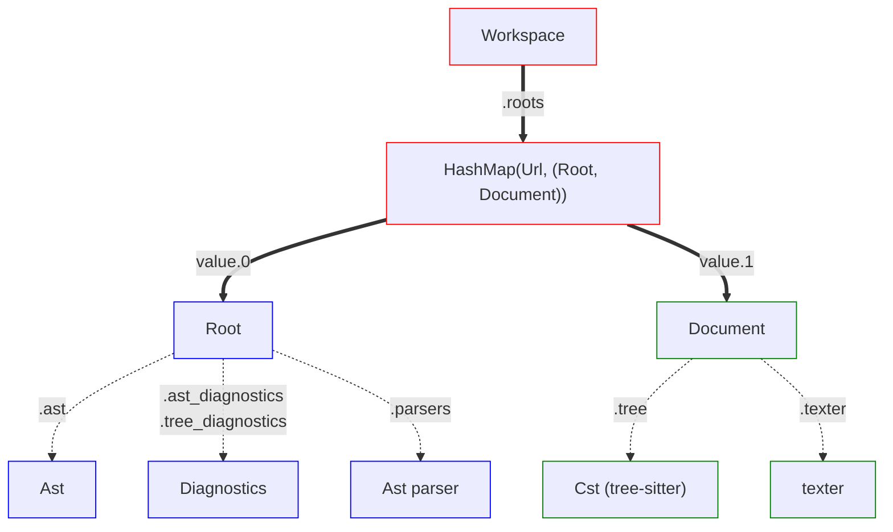

# Workspace

A `Workspace` is the top-level structure of the AST. 

It maintains a HashMap where:
 - The keys are [`Url`](https://docs.rs/lsp-types/0.95.1/lsp_types/struct.Url.html) instances
 - The values are tuples containing two other core components:
    - Root (handles AST and diagnostics).
    - Document (handles CST and text storage).

In the next sections, we will see how `Root` and `Document` work